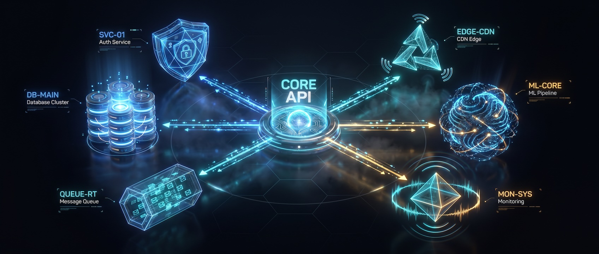

# [statecraft.ing](https://statecraft.ing)     

### Governed software delivery for the agentic era

**AI can write the code. The unsolved problem is trusting what it wrote.**

We build the machinery that makes machine-generated change *auditable*:   
the human authors the contract, agents do the work, and gates (not optimism) refuse anything
that drifts from the contract.  
Stop reviewing output; start constraining intent.

---

## The thesis

No human reviews every line an agent writes; pretending otherwise just moves the
bottleneck back to the human. So we move the trust boundary upstream. Intent
becomes a requirement, the requirement becomes a typed spec, and the spec becomes
law: a hash-verifiable contract that machinery enforces at PR time and at run time.

Agentic output is hostile by default. It earns passage by surviving gates, not by
appealing to trust. Humans gate the contracts (specs, approvals, irreversible
boundaries); everything between them is enforced, reconciled, and signed by code.
The result is delivery you can hand to an auditor: every change bound to the spec
that authorised it, every run emitting a certificate anyone can verify offline.

---

## The stack

Each project does one job; together they take you from a single hash-verified spec
all the way to a governed, self-auditing platform running in your own cloud.

  

---

## Projects

### The platform

#### [open-agentic-platform](https://github.com/statecrafting/open-agentic-platform)

A governed control plane for AI-native software delivery. Frozen, hash-verifiable
specs are the unit of governance: every change is bound to a spec, every spec
compiles to a deterministic registry, and drift between spec and code fails CI
before merge. Agents act through scoped tools, policy gates, and permission tiers;
SHA-256 proof chains and JSONL audit logs are the runtime substrate. Every run
emits a self-authenticating `governance-certificate.json` an auditor can verify
independently, and the OWASP ASI 2026 control-to-spec mapping is one CLI
invocation. Ships with a local Tauri + React cockpit (OPC) and an organisational
control plane (identity, policy, approvals, deployments, audit).

### The factory

#### [factory-encore](https://github.com/statecrafting/factory-encore)

A technology-agnostic software factory. It separates the *process* of building
software (requirements, design, specification) from the *implementation*
(frameworks, languages, patterns) by placing a formal *contract* between the two.
Business documents go in; a frozen, technology-free Build Specification comes out;
an adapter turns that specification into a running application. The process layer
never names a framework; add a stack by adding an adapter.

#### [template-encore](https://github.com/statecrafting/template-encore)

The runnable reference baseline the factory composes from: a public-facing SPA and
a staff-facing SPA, both backed by a single Encore.ts service cluster with a BFF
API gateway, stateless RS256 JWT auth, and Postgres. Vue 3 + PrimeVue with
pluggable authentication (rauthy OIDC or Mock). The factory clones this lean
baseline and composes the requested modules in, bound by a cross-repo lockstep so
the generator can never silently diverge from the baseline it targets.

### The tenant toolkit

#### [tenant-emit](https://github.com/statecrafting/tenant-emit)

An emit-only CLI a produced application pins to build a signed
`governance-certificate.json` from a finished run directory: scan every stage,
SHA-256 every artifact, lift the frozen Build Spec hash, attach an attributable
signer, and write a self-authenticating certificate. Identity-bearing and offline.

#### [tenant-tail](https://github.com/statecrafting/tenant-tail)

The verify-only counterpart: a CLI a produced application pins to re-check the
factory's run-side paperwork (artifact-hash chain, Ed25519 signature, platform
countersign, inter-stage manifest chain) with zero trust in the producer. Offline,
identity-free, read-only all the way down. *Spine to tail to emit:* spec-spine
compiles the corpus, tenant-tail verifies the run-side paperwork, tenant-emit
produces it.

### The primitive

#### [spec-spine](https://github.com/statecrafting/spec-spine)

The foundation everything else is built on: a typed, hash-verifiable authority
ledger over a markdown spec corpus. Each spec declares, in YAML frontmatter, the
files, sections, symbols, and crates it owns; a PR-time coupling gate refuses code
that drifts from its owning spec. Every artifact is a pure function of (config,
file contents): byte-identical output on every platform. Installable from
crates.io, npm, or PyPI. It governs itself, its own coupling gate runs against its
own spec corpus in CI.

### Day-zero operations

#### [oap-bootstrap](https://github.com/statecrafting/oap-bootstrap)

One resumable CLI that stands up an open-agentic-platform instance in a new GitHub
org and brings its Hetzner K3s estate online: fork the platform, register the
GitHub App, wire every secret, provision the cluster, configure DNS and OIDC, and
verify, without the multi-hour manual choreography. Every phase is idempotent, so
re-running one is how you resume after a fix.

---

## Why these licenses

The platform is **AGPL-3.0** on purpose: the audit chain is a public good for
regulated buyers, and strong copyleft prevents that work from being absorbed into
proprietary control planes that strip the traceability while keeping the engine.
The primitives and tooling (spec-spine, the tenant toolkit, the factory,
oap-bootstrap) are **Apache-2.0**, so the building blocks are free to adopt
anywhere.

---

Built in the open from Edmonton, Canada by [**@bartekus**](https://github.com/bartekus)
and a fleet of governed agents, which is rather the point.

**[bartekus.com](https://bartekus.com)** · **[the platform ↗](https://github.com/statecrafting/open-agentic-platform)**

