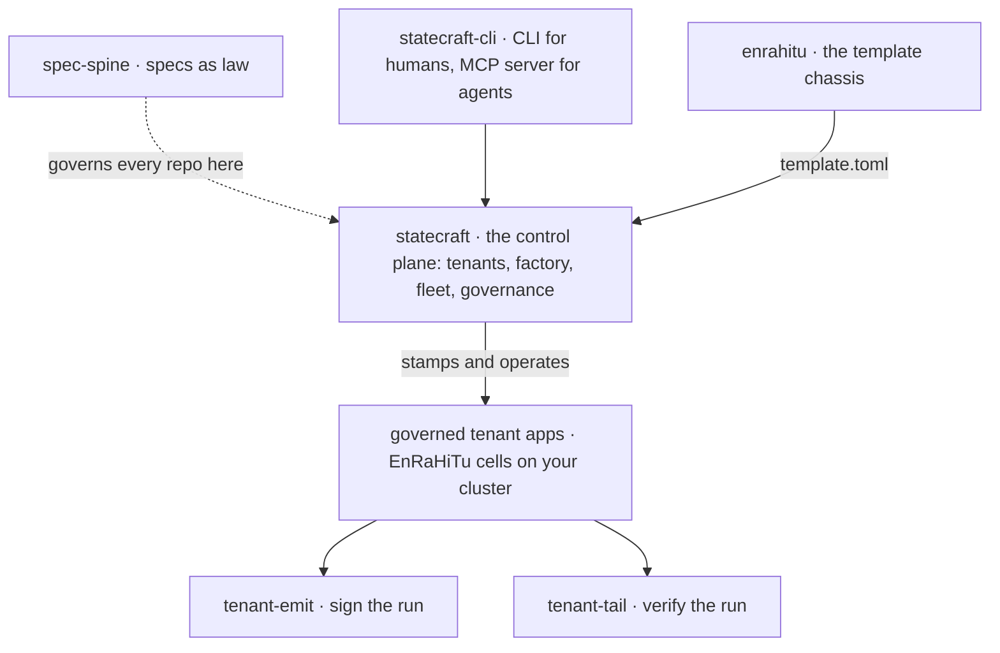

# [statecraft.ing](https://statecraft.ing)    

### Governed software delivery for the agentic era

**AI can write the code. The unsolved problem is trusting what it wrote.**

We build the machinery that makes machine-generated change *auditable*:  
the human authors the contract, agents do the work, and gates (not optimism) refuse anything
that drifts from the contract.  
Stop reviewing output; start constraining intent.

---

## The thesis

No human reviews every line an agent writes; pretending otherwise just moves the
bottleneck back to the human. So we move the trust boundary upstream. Intent
becomes a requirement, the requirement becomes a typed spec, and the spec becomes
law: a hash-verifiable contract that machinery enforces at PR time and at run time.

Agentic output is hostile by default. It earns passage by surviving gates, not by
appealing to trust. Humans gate the contracts (specs, approvals, irreversible
boundaries); everything between them is enforced, reconciled, and signed by code.
The result is delivery you can hand to an auditor: every change bound to the spec
that authorised it, every run emitting a certificate anyone can verify offline.

---

## The shape of the family

Statecraft is a two-plane system: the control plane is one EnRaHiTu app, and
every tenant app it stamps is another, independent one.

---

## Projects

### The platform

#### [statecraft](https://github.com/statecrafting/statecraft)

The governed agentic delivery control plane: tenants (per-customer GitHub App
installations), factory (stamps apps from the enrahitu template via its
versioned `template.toml` contract), fleet (operates the stamped apps on
hetzner-k3s), and the governance UI. It is itself the first production
EnRaHiTu app: the platform is governed by the same machinery it offers.

### The template

#### [enrahitu](https://github.com/statecrafting/enrahitu)

**EnRaHiTu**: **En**core.ts + **ra**uthy + **hi**qlite + **Tu**rso/libSQL. A
self-contained, single-container application core with zero
managed-infrastructure dependencies: typed APIs, a real OIDC identity
provider, and embedded Raft-replicated SQLite in one image. This is the
template chassis the Statecraft factory stamps; the Encore toolchain is
consumed as a published package and driven directly, no CLI anywhere.

### The interface

#### [statecraft-cli](https://github.com/statecrafting/statecraft-cli)

One binary, two faces: Statecraft's governance verbs as CLI subcommands for
humans and as an MCP server for agents, so a coding agent can request
approvals, check spec-code coupling, and trigger factory stages natively
under governance instead of shelling out around it.

### The spine

#### [spec-spine](https://github.com/statecrafting/spec-spine)

The foundation everything else is built on: a typed, hash-verifiable authority
ledger over a markdown spec corpus. Each spec declares, in YAML frontmatter, the
files, sections, symbols, and crates it owns; a PR-time coupling gate refuses code
that drifts from its owning spec. Every artifact is a pure function of (config,
file contents): byte-identical output on every platform. Installable from
crates.io, npm, or PyPI. It governs itself, its own coupling gate runs against its
own spec corpus in CI.

### The tenant toolkit

#### [tenant-emit](https://github.com/statecrafting/tenant-emit)

An emit-only CLI a stamped application pins to build a signed
`governance-certificate.json` from a finished run directory: scan every stage,
SHA-256 every artifact, lift the frozen spec hash, attach an attributable
signer, and write a self-authenticating certificate. Identity-bearing and offline.

#### [tenant-tail](https://github.com/statecrafting/tenant-tail)

The verify-only counterpart: a CLI a stamped application pins to re-check the
factory's run-side paperwork (artifact-hash chain, Ed25519 signature, platform
countersign, inter-stage manifest chain) with zero trust in the producer. Offline,
identity-free, read-only all the way down. *Spine to tail to emit:* spec-spine
compiles the corpus, tenant-tail verifies the run-side paperwork, tenant-emit
produces it.

### The primitives

#### [action-gate](https://github.com/statecrafting/action-gate)

A pure, deterministic decision gate over a pluggable Check registry:
`evaluate(context, checks)` returns Allow, Deny, or Degrade, with a stable
config hash so the policy that decided is itself attestable.

#### [attest-ledger](https://github.com/statecrafting/attest-ledger)

A tamper-evident record ledger: append-only, hash-linked, Ed25519-signed, with
an independent verifier that does not trust its producer.

#### [trust-window](https://github.com/statecrafting/trust-window)

A rolling-window trust scorer: weighted samples map to a graduated privilege
level, degrade-only or bidirectional, deterministic and snapshot-persistable.

#### [canonical-keysort-json](https://github.com/statecrafting/canonical-keysort-json)

Deterministic canonical JSON: a lexicographic key sort at the serialization
boundary, so record hashes agree everywhere.

### The packages

#### [statecrafting](https://github.com/statecrafting/statecrafting)

The shared native packages behind the family: the `@statecrafting/*` napi-rs
addons (hiqlite, kernel, governance, fleet) and the vendored Encore build
toolchain that statecraft and enrahitu consume. Licensed per package: the
building blocks stamped apps consume are Apache-2.0, the control-plane addons
are AGPL-3.0.

---

## Why these licenses

The control plane is **AGPL-3.0** on purpose: the audit chain is a public good
for regulated buyers, and strong copyleft prevents that work from being absorbed
into proprietary control planes that strip the traceability while keeping the
engine. Everything a stamped customer app consumes (the template, the CLI, the
tenant toolkit, the primitives) is **Apache-2.0**, so the building blocks are
free to adopt anywhere.

---

Built in the open from Edmonton, Canada by [**@bartekus**](https://github.com/bartekus)
and a fleet of governed agents, which is rather the point.

**[statecraft.ing](https://statecraft.ing)** · **[bartekus.com](https://bartekus.com)** · **[the control plane ↗](https://github.com/statecrafting/statecraft)**

